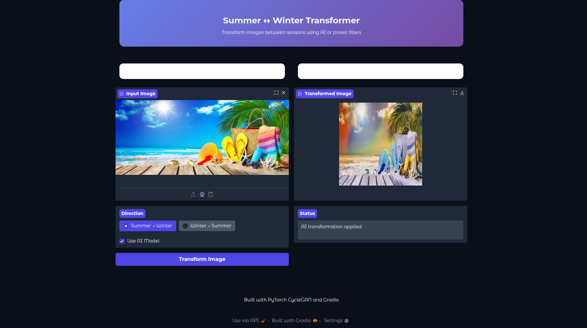
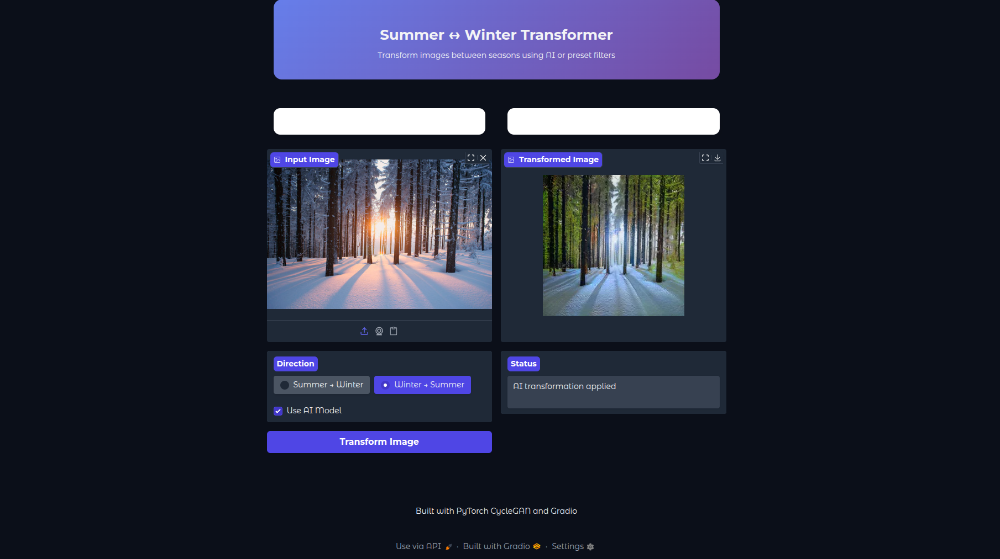

# 🌞 Summer ↔ ❄️ Winter Image Transformer

Transform your images seamlessly between **summer** and **winter** styles using a pretrained **CycleGAN** model and an interactive **Gradio** interface.

---

## ✨ Features
- Convert **summer photos into winter** landscapes.
- Transform **winter scenes back to summer**.
- User-friendly **Gradio web app**.
- Built with **PyTorch** and **CycleGAN** pretrained models.

---

## 🚀 Demo

### Summer → Winter  


### Winter → Summer  


---

## 📦 Installation

Clone the repository and install dependencies:

```bash
git clone https://github.com/your-username/Summer2Winter-CycleGAN.git
cd Summer2Winter-CycleGAN
pip install -r requirements.txt
```

---

## ▶️ Usage

Run the app:

```bash
python app.py
```

The Gradio interface will open in your browser.  
Upload an image and select the transformation direction.

---

## 📂 Project Structure
```
├── app.py              # Gradio interface
├── model.py            # CycleGAN Generator + ImageTransformer
├── checkpoints/        # Pretrained models
├── summertowinter.png  # Demo result (summer → winter)
├── wintertosummer.png  # Demo result (winter → summer)
└── README.md           # Project documentation
```

---

## 📧 Contact
For questions or collaboration, contact me at: **mariusc0023@gmail.com**
